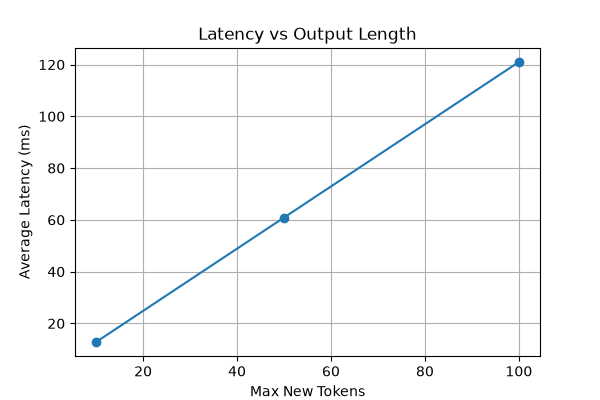
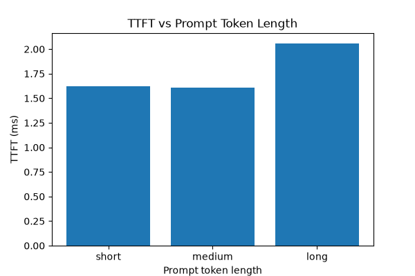
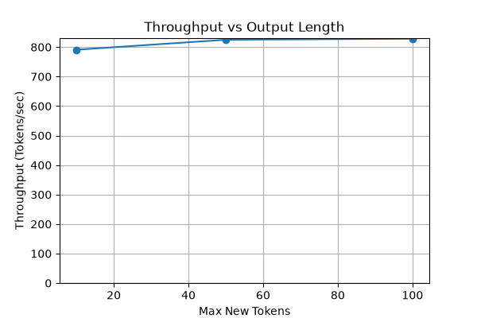

# KV Cache, FastAPI, streaming generation, runtime tracing, and benchmarking utilities

A minimal LLM model serving project built with PyTorch, Hugging Face Transformers, KV Cache, FastAPI, streaming generation, runtime tracing, and benchmarking utilities.

The goal of this project is to understand how modern LLM inference works under the hood by implementing the decoding loop manually instead of relying on high-level generation APIs.  

## Features
- Token-by-token autoregressive decoding
- KV Cache based inference using `past_key_values`
- EOS token based early stopping
- FastAPI serving endpoint
- Runtime tracing (TTFT, latency, throughput)
- Request correlation via `request_id`
- Benchmark framework with automated evaluation
- Performance visualization and analysis

## Example API
### Request
```json
{ 
    "query": "where is seattle located at?"
}
```
### Response
```json
{ 
    "status": "success",
    "request_id": "c0e50044-3148-47ee-9872-5e4cfaed94b9",
    "response": "where is seattle? stairs stairs stairs..." 
}
```

### Runtime Trace
Generation metrics are persisted to a runtime trace log and correlated with requests using `request_id`.  
```jsonl
{
    "request_id": "c0e50044-3148-47ee-9872-5e4cfaed94b9",
    "prompt_tokens": 6,
    "generated_tokens": 10,
    "total_tokens": 16,
    "max_new_tokens": 10,
    "hit_eos": False,
    "end_to_end_latency_ms": 14.5,
    "ttft_ms": 1.74,
    "tokens_per_second": 692,
}
```

## Benchmarking
The benchmark framework evaluates serving performance across different prompt lengths and output lengths.  

Collected metrics:
- TTFT (Time To First Token)
- End-to-End Latency in ms
- Tokens Per Second (TPS)

Benchmark results are automatically correlated with runtime traces through request Ids.

Benchmark visualizations include:
- Latency vs Output Length
- Throughput vs Output Length
- TTFT vs Prompt Length
- Throughput vs Prompt Length

### Key Findings
- End-to-end latency scales approximately linearly with generated output length.
- Longer prompts increase TTFT due to higher prefill cost.
- Decode throughput remains relatively stable across different prompt lengths and output lengths.

#### Latency vs Output Length


#### TTFT vs Prompt Length


#### Throughput vs Output Length


## Run Locally
```bash
pip install -r requirements.txt
python -m uvicorn app:app --reload
```
### SwaggerUI
```text
http://127.0.0.1:8000/docs
```

## Next Steps
- Request batching
- Continuous batching
- vLLM-inspired optimizations
